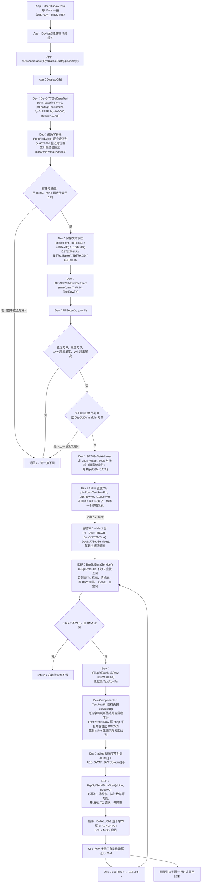
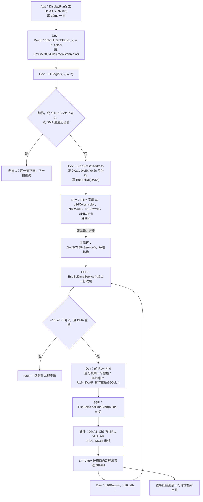
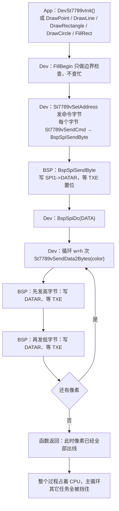

# 屏幕显示流程

## 0. 三条路径的关系

| 路径 | 入口 | 每行内容来源 | 什么时候走 |
|---|---|---|---|
| 带内容的 DMA | `DevSt7789vDrawText()` → `DevSt7789vBlitRectStart()` | 每行调一次回调 | 画文字、图标等任意图案 |
| 纯色的 DMA | `DevSt7789vFillRectStart()` / `DevSt7789vFillScreenStart()` | 整块同一个颜色 | 清屏、卡片底色、色块演示 |
| 阻塞逐像素 | 同上两个入口 | 同上 | 只有 `ST7789V_USE_DMA` 设成 0 时才编进来 |

前两条共用同一套推进器（`tFill` + `DevSt7789vService()`），差别只在 `Service()` 里一个分支：`pfnRow` 为 0 就整行填同一个颜色，不为 0 就调回调取这一行的像素。

`DevSt7789vDrawPoint` / `DrawLine` / `DrawRectangle` / `DrawCircle` / `FillRect` 这几个旧接口不分宏，永远走阻塞路径。

---

## 1. 文字显示（带内容的 DMA）



关键点：`DrawText` 那一趟只登记、设窗口，**不发像素**。真正搬数据是之后 `u16Left` 行、每行一趟主循环。

---

## 2. 纯色矩形（之前的 DMA 方式）



跟第 1 节的差别只有两处：入口是 `FillRectStart` 而不是 `BlitRectStart`，以及 `Service()` 里走的是"整行填同一个颜色"那个分支。

---

## 3. 阻塞逐像素（`ST7789V_USE_DMA` 设成 0 时）



同一个宏设成 1 时，这段代码根本不参与编译；`DrawPoint` 那几个旧接口是例外，它们永远走这条。

---

## 4. 设备层内部状态

| 变量 | 位置 | 含义 |
|---|---|---|
| `tFill.u16W` | `dev_st7789v.c` | 当前矩形宽度（像素） |
| `tFill.u16Color` | 同上 | 纯色填充用；`pfnRow` 非 0 时不看它 |
| `tFill.pfnRow` | 同上 | 0 = 纯色填充，非 0 = 每行内容由回调给 |
| `tFill.u16Row` | 同上 | 已发出的行数，从 0 起，回调用它 |
| `tFill.u16Left` | 同上 | 剩余行数，0 = 空闲（兼作忙标志） |
| `aLine[]` | 同上 | 480 字节行缓冲，一行像素，发送前就地转字节序 |
| `u8SpiDmaIdle` | `bsp_spi.c` | DMA 通道忙标志 |
| `u8SpiError` | 同上 | 传输错误锁存，置 1 后拒绝新传输 |
| `ptTextFont` 等 8 个 | `dev_st7789v.c` | 文本绘制的行来源状态，`TextRowFn` 每行读一次 |

`BspSpiSendDmaStart()` 依次做：关通道 → 清 TC/TE 标志 → 装计数 → 装源地址 → 开 SPI1 TX DMA 请求 → 开通道。
`BspSpiDmaService()` 依次做：查 TE（置错误锁存）或 TC（等 BSY 清零）→ 关通道 → 关 SPI1 TX 请求 → 置空闲。

DMA1 通道 3 的传输完成/错误中断没有开，收尾靠主循环轮询。启动文件里 `DMA1_Channel3_IRQHandler` 的弱符号默认处理是死循环，所以那个中断不能开。

---

## 5. 数据流

```text
字符串 → 字形表 → 2bpp 位图 → 混合成 RGB565 → 字节对调 → aLine → DMA → SPI → GRAM → 玻璃
         Components                        Dev                                BSP
```
